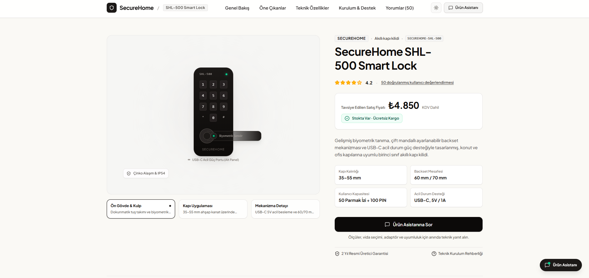
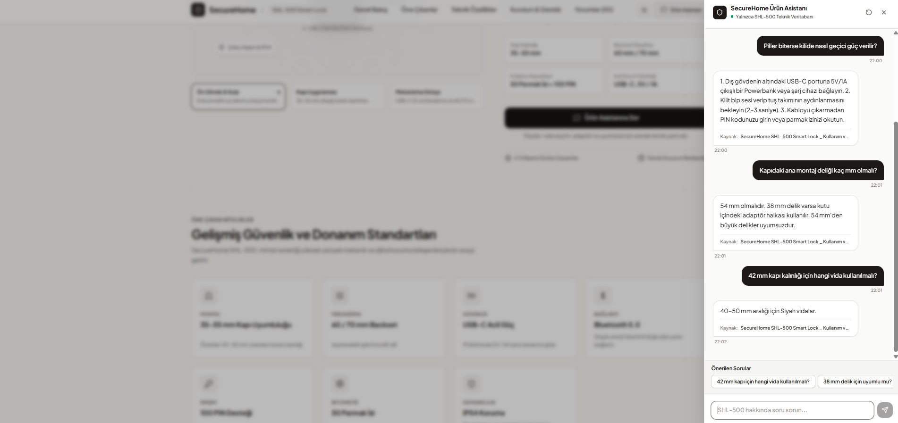
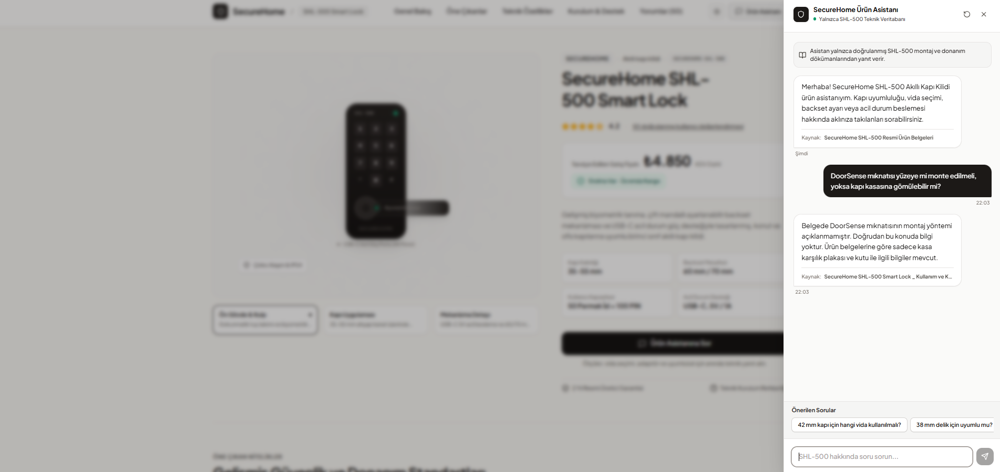
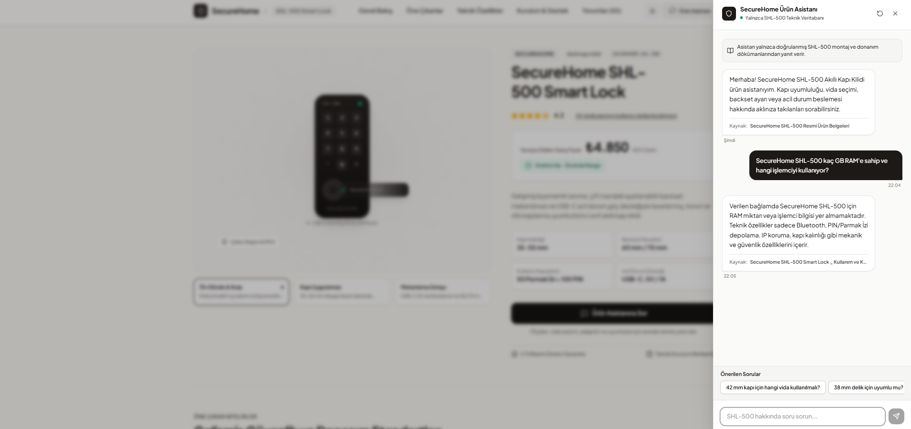

# Product RAG Chatbot

Bu proje, e-ticaret ürünlerinin teknik dokümanlarını ve kullanım kılavuzlarını anlayarak ürün sayfası üzerinden kaynaklı cevaplar veren RAG tabanlı bir chatbot prototipidir.

Amaç yalnızca PDF'i embedding'e çevirip aramak değildir. Farklı kalitedeki PDF'leri temizleyen, anlamlı chunk'lara bölen, doğru ürüne göre filtreleyen, retrieval sonuçlarını yeniden sıralayan ve Mistral ile doğal cevap üreten sürdürülebilir bir pipeline oluşturuyoruz.

## Genel akış

### Dokümandan Qdrant'a

```text
PDF katalog / kullanım kılavuzu
        ↓
Docling ile ham Markdown
        ↓
Markdown normalizasyonu + frontmatter metadata
        ↓
LangChain Markdown loader
        ↓
Başlık ve tablo farkındalıklı chunking
        ↓
Kalite filtresi + breadcrumb context
        ↓
multilingual-e5-small embedding
        ↓
Qdrant vector database
```

### Sorudan cevaba

```text
Kullanıcı sorusu + product_id
        ↓
Semantic search + BM25 keyword search
        ↓
RRF ile sonuçların birleştirilmesi
        ↓
Context expansion
        ↓
Cross-encoder reranker
        ↓
Mistral generation
        ↓
Cevap + kaynaklar
```

## Mimari

| Katman | Sorumluluk |
|---|---|
| `api` | FastAPI HTTP endpoint'leri |
| `schemas` | İstek ve cevap modelleri |
| `services` | Chat ve ingestion orkestrasyonu |
| `rag/loaders` | Docling, Markdown yükleme ve chunking |
| `rag/normalizers` | Parser artığı temizliği ve kalite kontrolü |
| `rag/retrievers` | Semantic, BM25, hybrid ve product retrieval |
| `rag/rerankers` | Aday chunk'ları yeniden sıralama |
| `rag/vectorstores` | Embedding ve Qdrant bağlantısı |
| `rag/prompts` | Generation prompt'ları |
| `frontend` | Ürün ekranı ve chatbot arayüzü |

## RAG kalitesini artırmak için yaptıklarımız

| İyileştirme | Faydası |
|---|---|
| Manifest metadata | Aynı ürüne ait farklı PDF'leri `product_id` altında toplar |
| Markdown normalizasyonu | Docling footer, placeholder, kontrol karakteri ve biçim artıklarını azaltır |
| Başlık farkındalıklı chunking | Teknik bilgi başlık ve tablo sınırlarında korunur |
| Breadcrumb context | Chunk'ın hangi ürün ve bölümden geldiğini embedding'e taşır |
| Chunk kalite filtresi | Boş, başlık-only ve düşük bilgi yoğunluklu chunk'ları eler |
| Hybrid retrieval | Semantic benzerlik ile exact keyword eşleşmesini birleştirir |
| Context expansion | Bölünmüş tablo ve yakın bölüm bağlamını tamamlar |
| Reranking | En uygun aday chunk'ı üst sıraya taşır |
| Deterministic chunk ID | Tekrar ingestion sırasında duplicate point oluşmasını önler |
| Kaynak kontrollü generation | Mistral'ın doküman dışı bilgi uydurmasını azaltır |

Normalizer bilinmeyen bir ürünün içeriğini elle yeniden yazmaz; genel yapısal temizlik uygular. Bu yüzden farklı ürün türleri için de kullanılabilir.

## Metadata ve kaynak türleri

Örnek ürün metadata'sı:

```yaml
product_id: SECUREHOME-SHL-500
product_name: SecureHome SHL-500 Smart Lock
source_type: technical_and_manual
```

İleride kullanıcı yorumları da ayrı kaynak türüyle indexlenecek:

```text
technical_and_manual
product_review
```

Yorumların planlanan akışı:

```text
PostgreSQL → RabbitMQ → sentiment worker → Qdrant review index
```

## Mevcut test ürünü

Şu an test ürünü SecureHome SHL-500 Smart Lock'tır.

```text
data/processed/securehome-shl-500-technical-and-manual.md
```

Doküman; kapı kalınlığı, vida seçimi, backset, delik çapı, DoorSense ve acil güç beslemesi gibi gerçekçi teknik senaryolarla test edilmektedir.

## Kurulum

```powershell
python -m venv .venv
.venv\Scripts\Activate.ps1
pip install -r requirements.txt
```

`.env` dosyasına Mistral API anahtarını ekleyin. API anahtarını Git'e commit etmeyin.

Qdrant:

```powershell
docker compose up -d qdrant
```

Dashboard: <http://localhost:6333/dashboard>

## PDF dönüştürme ve ingestion

PDF'leri `data/document_manifest.yaml` içinde ürün ve belge türüyle eşleştirin:

```powershell
.venv\Scripts\python.exe -m scripts.convert_manifest data\document_manifest.yaml
.venv\Scripts\python.exe -m scripts.ingest
.venv\Scripts\python.exe -m scripts.inspect_chunks
```

## Backend ve frontend

Backend:

```powershell
.venv\Scripts\python.exe -m uvicorn src.main:app --reload --port 8000
```

Frontend:

```powershell
cd frontend
npm install
npm run dev
```

Frontend: <http://localhost:3000>

Chat endpoint'i:

```http
POST /api/v1/chat
```

```json
{
  "question": "42 mm kapı için hangi montaj vidası kullanılmalı?",
  "product_id": "SECUREHOME-SHL-500"
}
```

## Retrieval testi

```powershell
.venv\Scripts\python.exe -m scripts.search_product_retriever "42 mm kapı için hangi montaj vidası kullanılmalı?"
```

Hybrid retrieval testi:

```powershell
.venv\Scripts\python.exe -m scripts.search_hybrid_chunks "uygulama bağlantısı neden kopuyor"
```

## Ekran görüntüleri ve kaynak kontrollü cevaplar

### Ürün dashboard'u



Ürün ekranında chatbot seçili ürünle birlikte açılır. Frontend, ürünün `product_id` değerini backend'e gönderir. Böylece soru başka ürünlerin chunk'larıyla karışmaz.

### Kaynağa dayalı teknik cevaplar



Bu görüntüde pil bitmesi, ana montaj deliği ve vida seçimi soruları görülüyor. Cevapların altında kullanılan SecureHome SHL-500 dokümanı kaynak olarak gösteriliyor. Örneğin 42 mm kapı için 40–50 mm aralığına karşılık gelen siyah vidalar seçiliyor.

### Kaynakta olmayan bilgiyi uydurmama



DoorSense bilgisi mevcut SecureHome dokümanında bulunmadığı için chatbot yüzeye veya gömme montaja dair tahmin üretmiyor. Bunun yerine bilginin belgede bulunmadığını açıkça belirtiyor. Bu, RAG sisteminin dış bilgiyle cevap uydurmak yerine kaynak sınırına uymasıdır.



SecureHome SHL-500 için RAM ve işlemci bilgisi kaynaklarda bulunmadığından bu alanlar için cevap verilmediği belirtiliyor. Sistem yalnızca belgede gerçekten bulunan PIN, parmak izi, kapı kalınlığı ve güvenlik özellikleri gibi bilgileri bağlam olarak kullanıyor; RAM veya işlemci değeri icat etmiyor.

Bu davranışın temel kuralı şudur:

```text
Retrieval sonucu yoksa veya kaynak soruyu desteklemiyorsa:
cevap uydurma, bilginin dokümanda olmadığını belirt.
```

## Gelecek aşamalar

| Aşama | Amaç |
|---|---|
| Ürün ve yorum endpoint'leri | Ürünleri ve yorumları veritabanına almak |
| RabbitMQ worker | Yorum sentiment analizini arka planda çalıştırmak |
| Review indexing | İşlenmiş yorumları Qdrant'a eklemek |
| PostgreSQL | SQLite prototipinden gerçek ilişkisel veritabanına geçmek |
| Tool calling | Stok, sipariş ve ürün verilerini kontrollü araçlarla sorgulamak |
| Evaluation set | Retrieval doğruluğunu ve regresyonları ölçmek |

## Proje durumu

Ingestion, semantic search, BM25, hybrid retrieval, context expansion, reranking ve Mistral generation akışları çalışır durumdadır. Proje şu anda gerçek bir ürün sayfasındaki retrieval ve kaynaklı cevap üretimini test eden prototip aşamasındadır.
